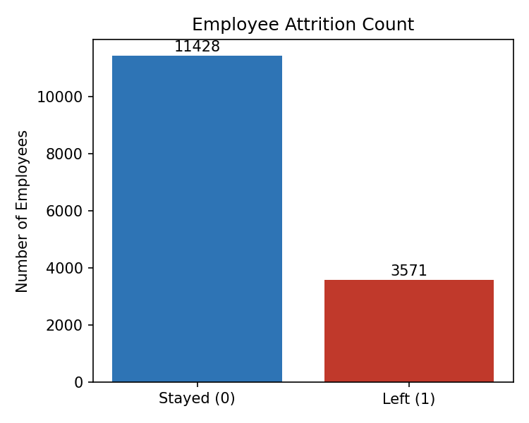
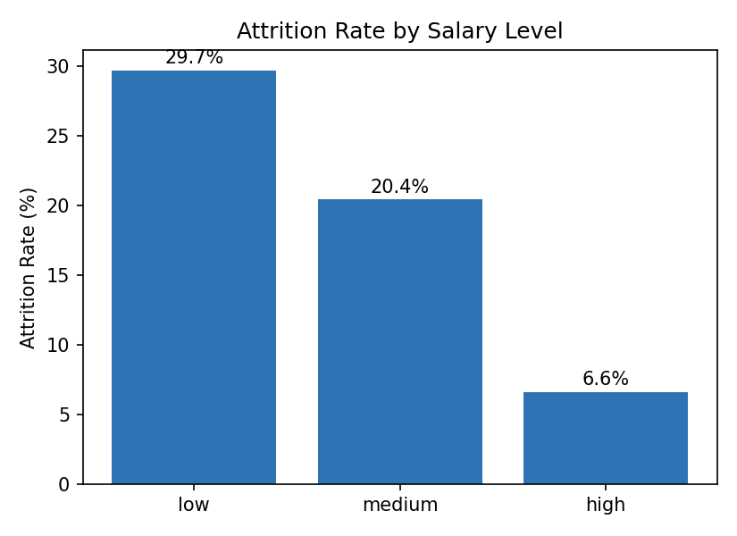
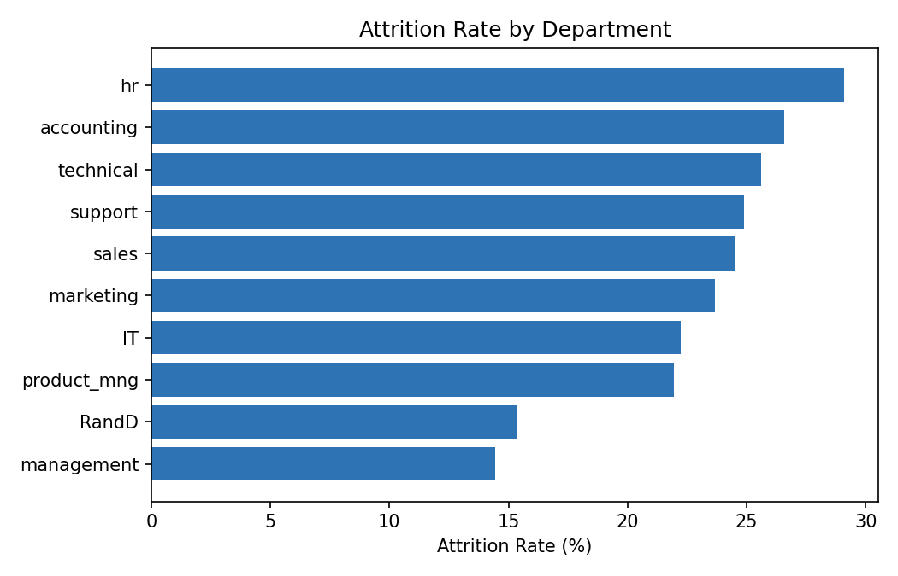

# Logistic Regression — Predicting Employee Attrition (HR Analytics)

A binary classification project predicting whether an employee will leave the company (`left`), using satisfaction level, average monthly hours, and recent promotion history — built with `scikit-learn`'s Logistic Regression on a real-world HR dataset of ~15,000 employees.

---

## 1. Project Objective

Identify which employee attributes have a clear, measurable impact on attrition, and build a logistic regression model that predicts whether an employee will leave the company using the features narrowed down through exploratory analysis.

## 2. Dataset

| Attribute | Detail |
|---|---|
| File | `HR_comma_sep.csv` |
| Observations | 14,999 employees |
| Missing values | None |
| Target variable | `left` (1 = left the company, 0 = stayed) |
| Attrition rate | 23.8% (3,571 of 14,999 employees left) |

**Available columns:** `satisfaction_level`, `last_evaluation`, `number_project`, `average_montly_hours`, `time_spend_company`, `Work_accident`, `left`, `promotion_last_5years`, `Department`, `salary`.

**Features used in the model:**

| Feature | Description |
|---|---|
| `satisfaction_level` | Employee's self-reported job satisfaction (0–1) |
| `average_montly_hours` | Average hours worked per month |
| `promotion_last_5years` | Whether the employee was promoted in the last 5 years (1/0) |

## 3. Tools & Libraries

- **Python 3**
- `pandas` — data handling
- `matplotlib`, `seaborn` — exploratory visualization
- `scikit-learn` — train/test split, `LogisticRegression`, evaluation metrics

## 4. Exploratory Data Analysis

Before modeling, the impact of salary and department on attrition was examined, since these are the two most actionable levers for HR policy:





| Salary Level | Attrition Rate |
|---|---|
| Low | 29.7% |
| Medium | 20.4% |
| High | 6.6% |

**Salary has a strong, clear relationship with attrition** — employees on low salaries leave at more than **4x the rate** of employees on high salaries.



| Department | Attrition Rate |
|---|---|
| HR | 29.1% |
| Accounting | 26.6% |
| Technical | 25.6% |
| Support | 24.9% |
| Sales | 24.5% |
| Marketing | 23.7% |
| IT | 22.2% |
| Product Mgmt | 22.0% |
| R&D | 15.4% |
| Management | 14.4% |

Department shows a **milder** effect than salary — a roughly 2x spread between the highest (HR) and lowest (Management) attrition rates, compared to salary's 4.5x spread.


Interestingly, employees who left do **not** simply have uniformly low satisfaction — the distribution is bimodal, with one cluster of clearly dissatisfied leavers (satisfaction < 0.2) and a second, smaller cluster of moderately satisfied leavers (satisfaction ~0.7–0.9), who likely left for reasons such as overwork or lack of promotion rather than dissatisfaction itself.

**Feature correlation with attrition (`left`):**

| Feature | Correlation with `left` |
|---|---|
| `satisfaction_level` | -0.388 (strongest) |
| `time_spend_company` | +0.145 |
| `Work_accident` | -0.155 |
| `average_montly_hours` | +0.071 |
| `number_project` | +0.024 |
| `last_evaluation` | +0.007 |
| `promotion_last_5years` | -0.062 |

`satisfaction_level` is by far the most correlated numeric feature with attrition, which is why it was selected as the primary driver for the model below, alongside `average_montly_hours` (a proxy for overwork) and `promotion_last_5years` (a proxy for career growth).

## 5. Methodology

1. **Load and inspect the dataset** — confirmed 14,999 rows, no missing values, and a 23.8% attrition rate.
2. **Exploratory analysis** — examined attrition by salary and department (above) to identify which variables have a clear, direct relationship with attrition before selecting model inputs.
3. **Feature and target selection** — chose `satisfaction_level`, `average_montly_hours`, and `promotion_last_5years` as the model's inputs, with `left` as the target.
4. **Train/test split** — 80% train / 20% test (`random_state=100`), giving 11,999 training and 3,000 test employees.
5. **Model training** — `sklearn.linear_model.LogisticRegression` fit on the three selected features.
6. **Evaluation** — accuracy, confusion matrix, and classification report on the held-out test set.

```python
X = df[['satisfaction_level', 'average_montly_hours', 'promotion_last_5years']]
y = df['left']

X_train, X_test, y_train, y_test = train_test_split(X, y, test_size=0.2, random_state=100)

model = LogisticRegression()
model.fit(X_train, y_train)
```

## 6. Model Results

| Term | Coefficient |
|---|---|
| `satisfaction_level` | **-3.667** |
| `average_montly_hours` | +0.0024 |
| `promotion_last_5years` | -1.529 |
| Intercept | +0.406 |

- **`satisfaction_level` has, by far, the largest effect** — each 1-point increase in satisfaction (on the 0–1 scale) sharply reduces the log-odds of leaving. This matches the strong correlation found during EDA.
- **`promotion_last_5years`** also has a large negative coefficient — being promoted in the last 5 years substantially reduces the odds of leaving.
- **`average_montly_hours`** has a very small positive coefficient on its raw (unscaled) scale — its effect is real but modest per additional hour worked.

## 7. Model Evaluation

| Metric | Value |
|---|---|
| Train / Test split | 80% / 20% (11,999 / 3,000 employees) |
| **Accuracy** | **77.4%** |

**Confusion Matrix (test set, n=3,000)**

| | Predicted: Stayed | Predicted: Left |
|---|---|---|
| **Actual: Stayed** | 2,112 (TN) | 138 (FP) |
| **Actual: Left** | 540 (FN) | 210 (TP) |

**Classification Report**

| Class | Precision | Recall | F1-score | Support |
|---|---|---|---|---|
| 0 — Stayed | 0.80 | 0.94 | 0.86 | 2,250 |
| 1 — Left | 0.60 | 0.28 | 0.38 | 750 |
| **Accuracy** | | | **0.77** | 3,000 |
| Macro avg | 0.70 | 0.61 | 0.62 | 3,000 |
| Weighted avg | 0.75 | 0.77 | 0.74 | 3,000 |

- The model is **much better at identifying employees who will stay (94% recall)** than employees who will leave (28% recall).
- Given the 23.8% baseline attrition rate, a model that always predicted "stayed" would already score ~76.2% accuracy — meaning the model's 77.4% accuracy is only a marginal improvement in raw accuracy terms, even though it does add real signal (visible in the non-trivial precision/recall on the "left" class).
- This is a common and important pattern in imbalanced HR/churn datasets: **accuracy alone is a misleading headline metric**; recall on the minority (attrition) class is the number that actually matters for a retention program.

### Example prediction

```python
sample_employee = [[0.4, 250, 0]]  # satisfaction=0.4, avg monthly hours=250, no recent promotion
model.predict(sample_employee)        # → 0 (predicted to stay)
model.predict_proba(sample_employee)  # → [0.61 stay, 0.39 leave]
```

An employee with below-average satisfaction (0.4), a high monthly workload (250 hours), and no recent promotion is predicted to stay, but with meaningfully elevated leave-risk (39%) — illustrating how the model outputs a graded risk score rather than just a hard yes/no, which is more useful in practice for prioritizing retention outreach.

## 8. Key Insights

- **Low satisfaction is the single strongest driver of attrition** in this dataset, both in raw correlation and in the fitted model's coefficients.
- **Salary tier has a very strong relationship with attrition** (29.7% for low salary vs. 6.6% for high salary) — a clear, actionable lever for HR to prioritize retention budget.
- **Lack of promotion compounds the risk** — the model's negative coefficient on `promotion_last_5years` confirms career stagnation is a meaningful attrition driver independent of satisfaction.
- **The satisfaction-vs-attrition relationship is not purely linear** — a distinct group of moderately-satisfied employees also leave, suggesting overwork or blocked career growth as a separate attrition pathway worth investigating with additional features (`number_project`, `time_spend_company`).
- **The model catches only 28% of employees who actually leave** — on its own it would not be reliable for a real early-warning system without further tuning.

## 9. Limitations & Next Steps

- **Class imbalance (23.8% positive)** likely explains the low recall on the "left" class; class weighting (`class_weight='balanced'`), oversampling (SMOTE), or threshold tuning would likely improve minority-class detection.
- **Only 3 of 9 available features were used** — `salary` and `Department` showed a clear relationship with attrition during EDA but were not included in the model as numeric/encoded features; one-hot encoding these categorical variables and adding them to the feature set is a natural next step.
- **No regularization tuning or cross-validation** was performed; a `GridSearchCV` over `C` (and potentially comparing to a tree-based model like Random Forest) would likely improve both accuracy and recall.
- **Correlation ≠ causation** — the relationships identified here (e.g., low satisfaction → attrition) are associative; a causal HR intervention study would need a controlled comparison.

## 10. How to Run

```bash
pip install pandas matplotlib seaborn scikit-learn
jupyter notebook logreg_practice_ex2_Answer.ipynb
```

## 11. Repository Contents

| File | Description |
|---|---|
| `logreg_practice_ex2_Answer.ipynb` | Main analysis notebook |
| `HR_comma_sep.csv` | Source dataset |
| `attrition_count.png` | Overall attrition class balance |
| `salary_vs_retention.png` | Attrition rate by salary tier |
| `department_vs_retention.png` | Attrition rate by department |
| `satisfaction_distribution.png` | Satisfaction level distribution, stayed vs. left |
| `README.md` | This report |

## 12. Conclusion

This project demonstrates a full HR analytics workflow: exploring which factors relate to employee attrition (salary and department show clear, strong effects), selecting features based on that analysis, and fitting a logistic regression model that achieves 77.4% accuracy overall. The key finding — that low satisfaction and lack of promotion are the dominant drivers of attrition — provides a clear, actionable narrative for HR stakeholders, while the model's low recall on actual leavers (28%) highlights a concrete next step: prioritizing minority-class detection over raw accuracy for any real retention-risk tool built from this data.

---
**Tech stack:** Python · pandas · matplotlib · seaborn · scikit-learn
